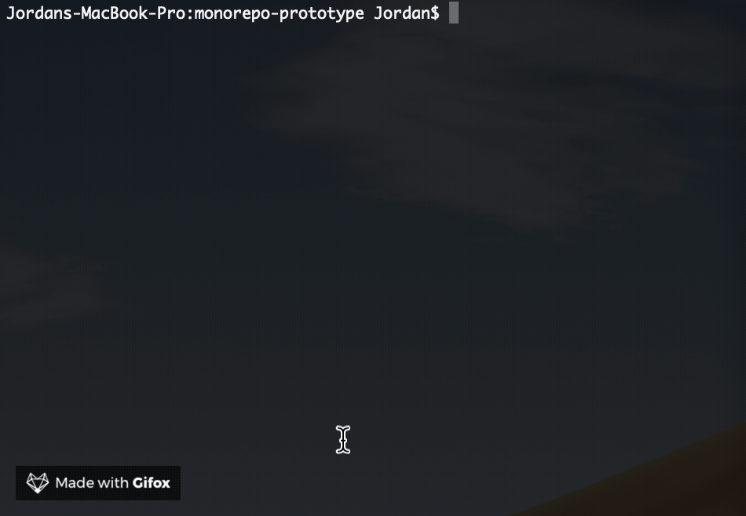

# lerna-runner 🏃‍
A CLI for running node scripts in monorepo packages.



## Getting Started


### Install it
```
yarn add -D lerna-runner
```

### Add the script

Add the script to your package.json.
```JSON
{
    "scripts": {
        "runner": "lerna-runner"
    }
}
```

### Run it

```
yarn runner
```

## FAQs

 - **Why is it not finding my packages?**

 `lerna-runner` looks for the `workspaces` key in your root `package.json` file and then searches your workspaces for directories containing their own `package.json` files. Make sure you have defined your `workspaces` inside of your root `package.json` file.

 ```JSON
 {
    "workspaces": [
        "apps/*",
        "packages/*"
    ],
}
```

- **Why is it not finding any scripts?**

After using the `workspaces` entry to find your packages and you select a package, `lerna-runner`